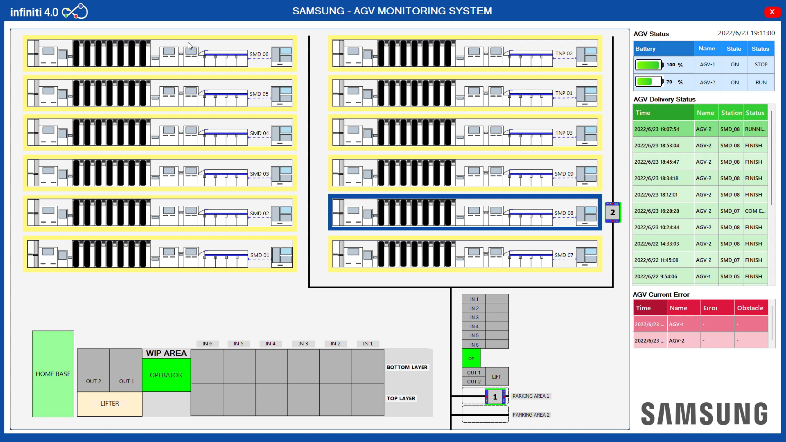
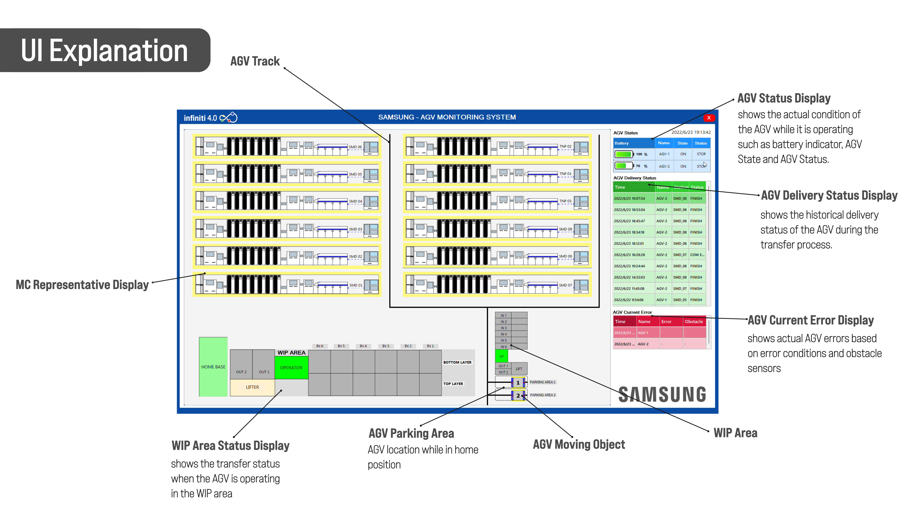

# SamsungAGV-UI

UI project to monitor the movement of Automated Guided Vehicle using Visual Studio Form Apps coded using C# programming language. We use Uvicorn as FastAPI for building APIs & web frameworks coded with Python.

### Proposed Design


### UI Explanation


### Built With

* [Uvicorn](https://www.uvicorn.org/) - Uvicorn FastAPI (Python Web Framework)
* [Visual Sttudio](https://visualstudio.microsoft.com/) - Visual Studio integrated development environment (IDE)
* [Bunifu Framework](https://bunifuframework.com/) - Bunifu Framework UI tools

### Prerequisites

Function dependencies used in this project:

- Python 3.9.13
- FastAPI 0.72.0
- Starlette 0.17.1
- Uvicorn 0.17.0
- Pydantic 1.8.2
- Requests 2.27.1

### Run Application
start AGV Server
```
..\run\python m_fileServer.pyc
pause
```

start web API
```
..\run\python m_webApi.pyc
pause
```

start backend python
```
cd "<your directory>\.NEW_VERSION\"
python backendPython.py
```

start all in one application
```
cd "<your directory>\.NEW_VERSION\agv\"
start AGVServer.bat
cd "<your directory>\.NEW_VERSION\agv\"
start webApi.bat
cd "<your directory>\.NEW_VERSION\"
start python backendPython.py
cd "<your directory>\.NEW_VERSION\bin\Debug"
start SampleUI-SamsungAGV.exe
```
change the `<your directory>` according to the directory where you save all the AGV files

### Possible Issues

- UI doesn't show AGV Data.
This can be caused by the AGV that has just been revived from a dead condition so that the data from the AGV has not responded. When this problem occurs, just run AGV with any mission/route. Then the AGV will automatically send data to the monitoring UI via the API (Application Programming Interface).


- Cross-Thread Error
<p align="center">
  
</p>
Solution for this issue

```
private async void callAPI()        
{
   .
   .
   .
   
   batteryLevel1.Value = (int)power;

   if (batValue1.InvokeRequired)                        
   {                            
       batValue1.Invoke(new Action(callAPI));                              
       return;                        
   }                        

   batValue1.Text = power.ToString();
   .
   .
   .

}
```

- NullReferenceException
<p align="center">
  
</p>
Solution for this issue

```
try                
{                    
    btnState = datanonArray.msg[1];                
}                

catch(NullReferenceException)                
{                    
    btnState = 1;                
}                

try                
{                    
    btnState2 = datanonArray2.msg[1];                
}                

catch (NullReferenceException)                
{                    
    btnState2 = 1;                
}
```
